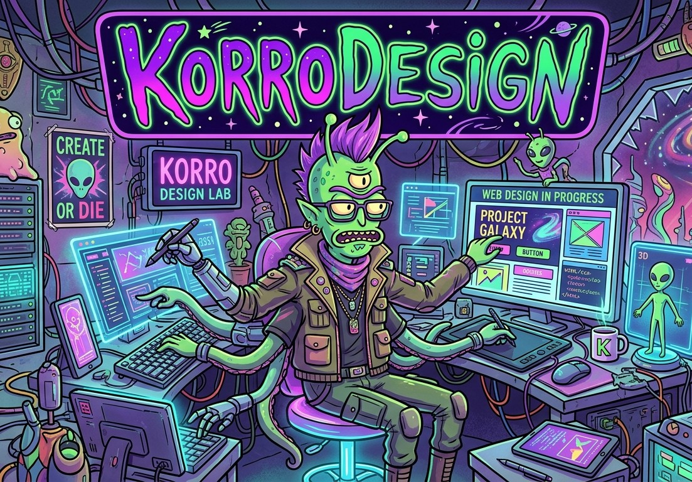

# KORRO Design Studio v3

<p align="center">
  <strong>Design Copilot for Claude Code</strong><br>
  Two enforcement layers. Zero dependencies. Awwwards-level output.
</p>

<p align="center">
  
</p>

<p align="center">
  <a href="#quick-start">Quick Start</a> ·
  <a href="#how-it-works">How It Works</a> ·
  <a href="#the-7-phases">7 Phases</a> ·
  <a href="#blind-spot-eslint-plugin">ESLint Plugin</a> ·
  <a href="#faq">FAQ</a>
</p>

---

## Why Korrodesign

AI-generated websites all look the same — purple gradients, Inter font, centered CTAs, zero personality. Existing tools (v0, Bolt, Lovable) generate fast but can't enforce design quality.

Korrodesign is a **design copilot** with two enforcement layers no other tool has:

1. **Taste Guardian** — guides Claude DURING generation. 500+ lines of design rules absorbed from 6 design philosophies. Catches mistakes before code is written.
2. **Blind Spot** — a 14-rule ESLint plugin that checks UI structural integrity AFTER generation. Not "is it beautiful" — "is this even maintainable as UI?"

Works standalone. Put the skill file in Claude Code and start designing. No API keys, no backend, no dependencies.

---

## Quick Start

```bash
# 1. Install the skill
git clone https://github.com/korro/korro-studio.git
cp -r korro-studio/korrodesign ~/.claude/skills/korrodesign

# 2. Reload Claude Code
/claude reload

# 3. Start your design session
/korrodesign
```

Claude becomes your Creative Director. The skill guides you through 7 phases — from asset generation to blind spot audit. Every rule in the SKILL.md is active during generation.

**Optional: install the ESLint plugin for post-generation checks:**

```bash
cp korro-studio/eslint-plugin-korro-design.js your-project/
cp korro-studio/eslint.config.korro.js your-project/
cd your-project
npx eslint . --config eslint.config.korro.js
```

---

## How It Works

```
┌─────────────────────────────────────────────────────┐
│                  /korrodesign                        │
│                                                     │
│  LAYER 1: TASTE GUARDIAN (during generation)        │
│  ┌───────────────────────────────────────────────┐  │
│  │  SKILL.md → Claude's system prompt            │  │
│  │  500+ lines of design rules                   │  │
│  │  Active during ALL code generation            │  │
│  │  Catches: fonts, colors, spacing, animations  │  │
│  └───────────────────────────────────────────────┘  │
│                    ↓                                 │
│              Code is generated                      │
│                    ↓                                 │
│  LAYER 2: BLIND SPOT (post-generation)              │
│  ┌───────────────────────────────────────────────┐  │
│  │  eslint-plugin-korro-design.js                │  │
│  │  14 AST-level rules                           │  │
│  │  Catches: div-as-button, missing focus,       │  │
│  │  z-index chaos, magic numbers, duplicate hex  │  │
│  └───────────────────────────────────────────────┘  │
│                                                     │
│  Result: Awwwards-level site with enforced quality   │
└─────────────────────────────────────────────────────┘
```

**Taste Guardian** works within Claude — the SKILL.md becomes part of Claude's context. Every code generation is filtered through these rules.

**Blind Spot** works as a standalone ESLint plugin. Piggybacks on ESLint's existing distribution channel — every team already has ESLint in CI. One config line adds UI structural integrity checks.

---

## The 7 Phases

| # | Phase | What Happens | Time |
|---|-------|-------------|------|
| 0 | **Asset Gen** | Generate 3D models (Meshy.ai), images (Pollinations.ai), audio (ElevenLabs) before design begins | 2 min |
| 1 | **Creative Brief** | Stage detection (pre-launch/growth/mature) + 6 questions asked one at a time | 5 min |
| 2 | **Configuration** | DESIGN_VARIANCE, MOTION_INTENSITY, VISUAL_DENSITY deduced from brief | 1 min |
| 3 | **Council** | 3 contrasting creative directions (Safe / Bold / Hybrid) + 69-company inspiration library | 3 min |
| 4 | **Execution Plan** | 3 steps: Foundations → Signature → Polish | 1 min |
| 5 | **Generation** | Code generation via Claude (or optional OpenRouter backend for automated gen) | 5-15 min |
| 6 | **Blind Spot Audit** | ESLint audit → auto-fix → pre-commit gate. UI violations block commits | 30 sec |

**Total: ~20 minutes** from idea to production-ready, design-enforced website.

### Phase 3 — The Inspiration Library

During the Council phase, the skill can reference design palettes from 69+ companies:

Stripe, Apple, Linear, Vercel, Figma, Notion, Supabase, Spotify, Nike, SpaceX, Airbnb, Pinterest, Shopify, and 55+ more.

Each palette includes: exact hex values, typography pairings, spacing scales, shadow systems, and border radius tokens.

---

## Installation

### Minimal: Claude Code Skill Only

```bash
cp SKILL.md ~/.claude/skills/korrodesign/SKILL.md
```

That's it. `/korrodesign` now works in Claude Code. The Taste Guardian activates on every invocation.

### Full: Skill + ESLint Plugin + Tools

```bash
# Clone the repo
git clone https://github.com/korro/korro-studio.git
cd korro-studio

# Skill
cp -r korrodesign ~/.claude/skills/korrodesign

# ESLint Plugin (copy to any project)
cp korrodesign/korro-studio/eslint-plugin-korro-design.js my-project/
cp korrodesign/korro-studio/eslint.config.korro.js my-project/

# Or scaffold a fresh Next.js project with everything pre-configured
node korrodesign/korro-studio/scaffold.js my-new-project
```

### Optional: OpenRouter Backend

For automated one-click generation, add to `~/.claude/.env`:

```bash
OPENROUTER_API_KEY=sk-or-v1-...
```

Then `node generate.js --prompt-file BRIEF_CURRENT.md --output-dir my-project` generates the full project automatically.

---

## Blind Spot ESLint Plugin

14 AST-level rules. No other tool checks these at the component level.

### Core Rules (error)

| Rule | What It Catches | Example Violation |
|------|----------------|-------------------|
| `no-div-as-button` | `<div onClick>` without button semantics | `<div onClick={handler}>Click</div>` |
| `require-focus-visible` | Interactive elements missing focus styles | `<button className="bg-blue-500">` |
| `no-pure-black` | `#000` / `#000000` in code | `style={{ color: "#000" }}` |
| `no-generic-fonts` | Inter, Arial, Helvetica, system-ui | `className="font-Inter"` |
| `no-emoji-in-ui` | Emoji in JSX text content | `<div>🚀 Launch</div>` |
| `no-h-screen` | `h-screen` — breaks on mobile | `className="h-screen"` |

### Supporting Rules (warn)

| Rule | What It Catches | Example Violation |
|------|----------------|-------------------|
| `no-z-index-chaos` | z-index outside [0,10,20,30,40,50] | `className="z-[9999]"` |
| `spacing-grid-4px` | Spacing not on 4px grid | `className="p-[7px]"` |
| `require-image-outlines` | `` without subtle outline | `` |
| `prefer-concentric-radii` | Nested radius mismatch | Outer `rounded-2xl`, inner `rounded-2xl` |
| `no-hardcoded-magic-numbers` | Raw numbers in style props | `style={{ marginTop: 37 }}` |
| `no-duplicate-colors` | Same hex across one file | `#ff6600` used in 2 places |
| `require-loading-state` | Async components without loading | `async function Component()` with no Suspense |
| `no-default-tailwind-colors` | `blue-500`, `gray-100` etc | `className="bg-blue-500"` |

### Usage

```bash
# Audit
npx eslint . --config eslint.config.korro.js

# Auto-fix (where supported)
npx eslint . --config eslint.config.korro.js --fix

# CI gate (block commits with violations)
npx eslint . --config eslint.config.korro.js --max-warnings 0
```

### Editor Integration

Add to your VS Code `settings.json` for real-time squiggles:

```json
{
  "eslint.options": {
    "overrideConfigFile": "eslint.config.korro.js"
  }
}
```

---

## Studio Rules (Taste Guardian)

The SKILL.md enforces these during generation. Claude will not produce code that violates these.

### Fonts
- **Display**: Cabinet Grotesk, Clash Display, DM Serif Display, Playfair Display, Boska, Chillax
- **Body**: Satoshi, Switzer, Geist Sans, DM Sans
- **Mono**: Geist Mono, JetBrains Mono, Fira Code
- **Forbidden**: Inter, Arial, Helvetica, system-ui

### Colors
- One accent max, saturation below 80%
- Neutral base: Zinc or Slate — never gray
- Accent options: Emerald, Electric Blue, Deep Rose, Amber, Teal
- Pure black (`#000`) is banned — use off-black (`#0a0a0a`)

### Motion
- Animate `transform` + `opacity` only — never `top`/`left`/`width`/`height`
- Spring physics over linear: `{ type: "spring", stiffness: 100, damping: 20 }`
- Duration under 300ms for all UI animations
- Enter animations faster than exits

### Layout
- `min-h-[100dvh]` — never `h-screen`
- Concentric border radii: outer = inner + padding
- Grid over flexbox math
- Dark mode with smooth transitions

### Anti-Slop
- No purple/blue glow aesthetic
- No 3-column generic card grids
- No "Welcome to my website", "elevate", "seamless", "unleash"
- No emoji, no Lorem Ipsum, no John Doe

---

## Automation Tools

```
korro-studio/
├── scaffold.js                    Init Next.js 15 + Tailwind v4 + fonts + Lenis + Grain + ESLint
├── generate.js                    OpenRouter pipeline (GLM 5.2 → Kimi K2.7 → quality check → build)
├── quality-check.js               Cross-file structural checks (config, grain, slop phrases)
├── eslint-plugin-korro-design.js  14 AST-level rules
└── eslint.config.korro.js         Ready-to-use flat config
```

### scaffold.js

```bash
node scaffold.js my-project
```

Creates a fully configured Next.js 15 project with:
- TypeScript, Tailwind CSS v4, App Router
- Premium fonts (Cabinet Grotesk + Satoshi)
- Lenis smooth scroll
- Grain texture overlay component
- ESLint plugin pre-installed with `eslint.config.korro.js`
- All React dependencies (Framer Motion, GSAP, Three.js, R3F, Phosphor Icons)

### generate.js (needs OPENROUTER_API_KEY)

```bash
node generate.js --prompt-file BRIEF_CURRENT.md --output-dir my-project
```

Pipeline:
1. GLM 5.2 reads the brief → produces complete design spec (colors, typography, spacing, shadows, component specs)
2. Kimi K2.7 reads the design spec → generates production Next.js code for every component
3. Runs quality-check.js and npm install
4. Output ready for `npm run dev`

### quality-check.js

```bash
node quality-check.js my-project
```

Cross-file structural validation:
- Checks `tailwind.config.ts` has custom palette
- Detects Grain component import in layout
- Scans for AI slop phrases across the project
- Verifies project structure completeness

---

## FAQ

### Do I need an API key?
No. The skill works entirely within Claude Code. The ESLint plugin and quality checker are standalone Node scripts. Only the optional `generate.js` needs an OpenRouter key.

### What if I don't use Next.js?
The Studio Rules and ESLint plugin work with any React framework. The design phases are framework-agnostic. scaffold.js and generate.js are Next.js-specific but entirely optional.

### Can I use this without Claude Code?
The SKILL.md is a Claude Code skill format. The ESLint plugin and quality-check.js work as standalone Node tools with any project.

### How is this different from v0/Bolt/Lovable?
Those are AI code generators. Korrodesign is a design enforcement system. It doesn't just generate — it enforces quality through two independent layers. The Taste Guardian catches mistakes during generation. Blind Spot catches what slips through.

### What does "14 rules, zero false positives" mean?
Every Blind Spot rule checks an objective property of the code. `no-div-as-button` checks if `<div>` has `onClick` without `role="button"`. This is binary — it's either a button or it's not. No subjectivity, no "I think this looks bad."

### Can I add my own rules?
Yes. Copy `eslint-plugin-korro-design.js` and add rules following the ESLint rule format. The plugin is standard ESLint — any ESLint rule structure works.

### How do I run Blind Spot in CI?
Add to your CI pipeline:
```yaml
- run: npx eslint . --config eslint.config.korro.js --max-warnings 0
```
Violations fail the build — same as any ESLint error.

---

## Knowledge Foundation

Korrodesign v3 absorbed six design philosophies into a single skill:

- **Emil Kowalski's Design Engineering** — Animation decision framework, CSS transform mastery, spring physics, Sonner principles
- **UI/UX Pro Max** — Creative arsenal of 25 premium UI concepts (Bento 2.0, Magnetic Button, Kinetic Marquee, etc.)
- **YC Web Design Strategy** — Stage-aware design (pre-launch vs growth vs mature), 5-second filter, copy anti-slop
- **Awesome DESIGN.md** — 69+ curated design system palettes from Stripe, Apple, Linear, Vercel, Figma, Notion, etc.
- **Make Interfaces Feel Better** — Concentric border radii, optical alignment, shadow-as-border, image outlines, minimum hit areas
- **Media Generation** — Meshy.ai for 3D, Pollinations.ai for images, ElevenLabs for audio

---

## Contributing

```bash
git clone https://github.com/korro/korro-studio.git
cd korro-studio
```

To add a new ESLint rule:
1. Add the rule function to `eslint-plugin-korro-design.js`
2. Register it in the `rules` and `configs` exports
3. Add a test case to verify it fires correctly

To improve the Taste Guardian:
1. Edit `SKILL.md` — the rules are plain markdown
2. Test with `/korrodesign` in a fresh Claude Code session

---

## License

MIT — KORRO
