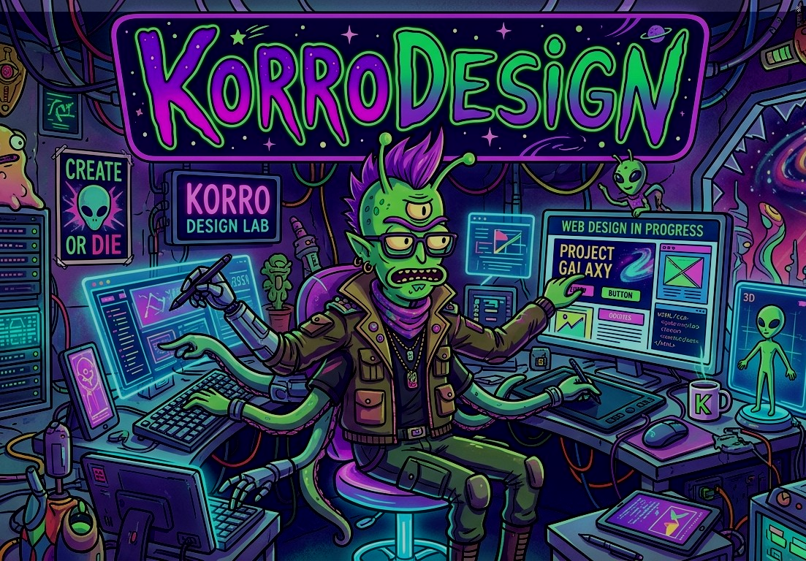
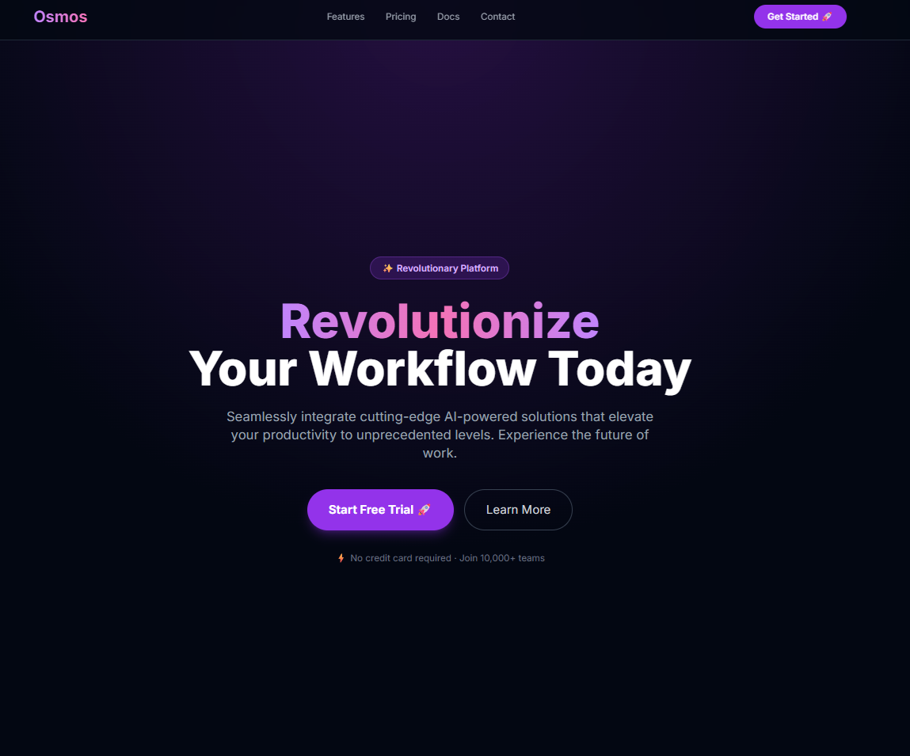
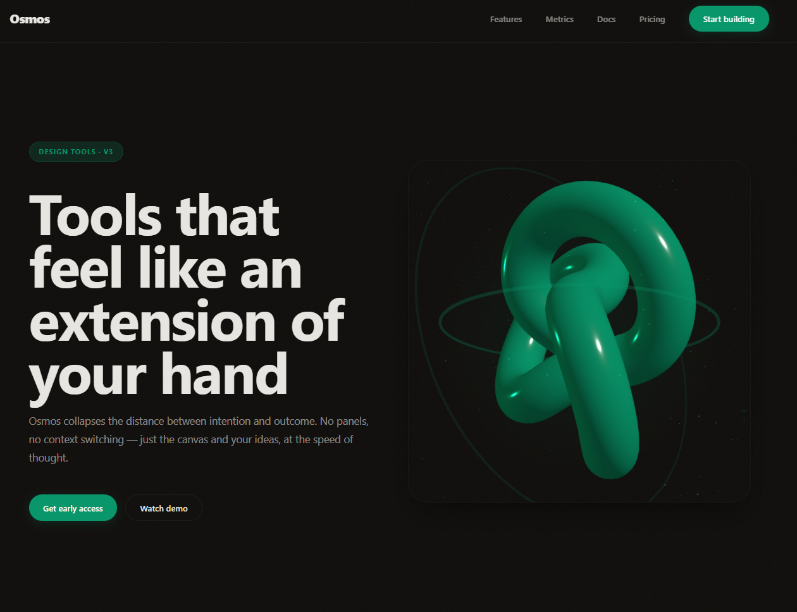

# KORRO Design

<p align="center">
  
</p>

**Design Copilot for Claude Code. Two enforcement layers. Zero dependencies. Awwwards-level output.**

<p align="center">
  <a href="#quick-start">Quick Start</a>, 
  <a href="#how-it-works">How It Works</a>, 
  <a href="#the-7-phases">7 Phases</a>, 
  <a href="#blind-spot-eslint-plugin">ESLint Plugin</a>, 
  <a href="#faq">FAQ</a>
</p>

---

## About

**KORRO Design** is built and maintained by **Korrocorp** under the [KorroAi](https://github.com/KorroAi) organization. It is a design enforcement system for AI-generated websites, not another code generator. While tools like v0, Bolt, and Lovable produce the same visual slop — purple gradients, Inter font, centered CTAs — KORRO Design enforces quality through two independent layers that no other tool has.

**What it does**: A Claude Code skill that transforms Claude into your Creative Director, guiding you through a 7-phase design process. A 14-rule ESLint plugin catches structural UI violations post-generation. Together they ensure every output is distinctive, maintainable, and production-ready.

**By the numbers**:
- 7 design phases (Brief through Blind Spot Audit)
- 2 enforcement layers (Taste Guardian + Blind Spot ESLint)
- 14 ESLint rules checking AST-level UI integrity
- 500+ lines of design knowledge from 6 design philosophies
- Zero runtime dependencies for the skill itself

**License**: MIT — see [LICENSE](LICENSE).

---

## Quick Start

```bash
# Clone into Claude Code skills directory
git clone https://github.com/KorroAi/korrodesign.git ~/.claude/skills/korrodesign

# The skill activates when you invoke /korrodesign
# Claude guides you through 7 phases from brief to final audit

# For the ESLint plugin (post-generation):
cp eslint-plugin-korro-design.js your-project/
echo "module.exports = { plugins: ['korro-design'], rules: { 'korro-design/no-div-as-button': 'error' } }" > eslint.config.korro.js
npx eslint . --config eslint.config.korro.js
```

---

## How It Works

KORRO Design operates through two independent enforcement layers:

### Layer 1: Taste Guardian (during generation)

The `SKILL.md` becomes part of Claude's context. Every code generation is filtered through 500+ lines of design rules absorbed from 6 design philosophies. Mistakes are caught before code is written. Zero dependencies, runs entirely within Claude.

### Layer 2: Blind Spot (post-generation)

A standalone 14-rule ESLint plugin checking UI structural integrity at the AST level. Not "is it beautiful", it is "is this even maintainable as UI?" Piggybacks on ESLint's existing distribution: every team already has ESLint in CI. One config line adds UI structural integrity checks.

---

## The 7 Phases

### Phase 0: Asset Generation
Generate 3D models (Meshy.ai), images (Pollinations.ai), sound effects (ElevenLabs), and voice/TTS (Edge TTS) before design begins.

### Phase 1: Creative Brief
Claude asks 6 questions: Identity, Personality, 3D Level, Reference, Five-Second Filter, and Content sections. Your answers define the entire design direction.

### Phase 2: Configuration
Next.js 15 scaffold with shadcn/ui, fonts, grain texture, Lenis smooth scroll. `scaffold.js` does this in one command if using the optional OpenRouter backend.

### Phase 3: Council (Design Debate)
Three directions proposed: Safe (conventional), Bold (distinctive), Hybrid (balanced). You choose, Claude executes.

### Phase 4: Execution Plan
Three layers of implementation: Foundations (structure, routing, palette, typography), Signature (the wow element), Polish (micro-interactions, responsive, transitions).

### Phase 5: Generation
Claude generates the complete implementation following the execution plan. Every line filtered through Taste Guardian rules.

### Phase 6: Blind Spot Audit
Post-generation ESLint audit catches structural violations. 14 rules check everything from `no-div-as-button` to `no-hardcoded-colors`.

---

## Architecture

```
korrodesign/
├── SKILL.md                        # Claude Code skill entry point (Taste Guardian)
├── README.md                       # This file
├── LICENSE                         # MIT
├── korrodesign.png                 # Hero illustration
├── BRIEF_CURRENT.md                # Current design brief template
├── korro-studio/
│   ├── package.json                # Node.js package config
│   ├── eslint-plugin-korro-design.js  # 14-rule ESLint plugin (Blind Spot)
│   ├── quality-check.js            # Post-generation quality auditor
│   ├── scaffold.js                 # Next.js 15 project scaffold
│   └── generate.js                 # Automated code generation (OpenRouter)
└── demo/
    ├── before.png                  # Before KORRO Design
    ├── after.png                   # After KORRO Design
    ├── 2-after-korrodesign.html    # HTML output example
    └── REDDIT_POST.md              # Launch post
```

---

## Blind Spot ESLint Rules

| Rule | What It Catches | Example Violation |
|---|---|---|
| `no-div-as-button` | `<div>` with `onClick` without `role="button"` | `<div onClick={handler}>Click</div>` |
| `no-hardcoded-colors` | Hex/rgb colors not using CSS variables | `className="text-[#ff0000]"` |
| `no-h-screen` | `h-screen` breaks on mobile safari | `className="h-screen"` |
| `no-absolute-overflow` | Absolute positioning without overflow handling | `className="absolute top-0"` |
| `no-empty-alt` | Images without alt text | `` |
| `no-aria-hidden-focusable` | `aria-hidden` on focusable elements | `<button aria-hidden="true">` |
| `no-missing-label` | Form inputs without associated labels | `<input type="text">` |
| `no-autoplay-video` | Video with autoplay without muted | `<video autoplay>` |
| `no-orphaned-sr-only` | `.sr-only` without focusable fallback | `<span className="sr-only">` |
| `no-inline-event-handlers` | Inline event handlers | `<button onclick="...">` |
| `no-fixed-z-index-abuse` | z-index values over 100 | `className="z-[999]"` |
| `no-non-semantic-headings` | Skipping heading levels | `<h1>` then `<h3>` |
| `no-motion-sensitive-animations` | Animations without `prefers-reduced-motion` | `@keyframes spin` |
| `no-generic-aria-labels` | Generic ARIA labels | `aria-label="button"` |

---

## Quality Rules

### Typography
- Font pairing: display font + body font. Never a single font.
- Neutral base: Zinc or Slate, never gray.
- Pure black (`#000`) is banned: use off-black (`#0a0a0a`).
- Zero dashes in prose: commas and colons only. No em dashes, en dashes, or double hyphens.

### Animation
- Animate `transform` and `opacity` only: never `top`, `left`, `width`, or `height`.
- Duration: 150-300ms for micro-interactions, 500-1000ms for page transitions.
- Always respect `prefers-reduced-motion`.

### Responsive
- `min-h-[100dvh]`: never `h-screen`.
- Test at 320px, 375px, 768px, 1024px, 1440px.
- Touch targets minimum 44x44px.

### Visual
- Colorblind-friendly palette (ColorBrewer or viridis).
- Concentric border radii: outer = inner + padding.
- Shadow as border: `box-shadow: 0 0 0 1px rgba(0,0,0,0.1)`.
- Optical alignment over mathematical centering.

---

## Design Philosophies (Taste Guardian Sources)

The 500+ lines of SKILL.md rules are synthesized from:
- **Emil Kowalski's Design Engineering**: Animation decision framework, CSS transform mastery, spring physics
- **UI/UX Pro Max**: 25 premium UI concepts (Bento 2.0, Magnetic Button, Kinetic Marquee)
- **YC Web Design Strategy**: Stage-aware design, 5-second filter, copy anti-slop
- **Awesome DESIGN.md**: 69+ curated design system palettes (Stripe, Apple, Linear, Vercel, Figma, Notion)
- **Make Interfaces Feel Better**: Concentric border radii, optical alignment, shadow-as-border, minimum hit areas
- **Media Generation**: Meshy.ai (3D), Pollinations.ai (images), ElevenLabs (audio)

---

## Demo

### Before (Typical AI Output)

<p align="center">
  
</p>

*Standard AI-generated website: purple gradient, Inter font, emoji CTAs, centered white text on colored background.*

### After (KORRO Design Output)

<p align="center">
  
</p>

*KORRO Design output: distinctive typography, intentional color palette, proper visual hierarchy, production-ready code.*

---

## FAQ

**How is this different from v0, Bolt, or Lovable?**

Those are AI code generators. KORRO Design is a design enforcement system. It does not just generate, it enforces quality through two independent layers. The Taste Guardian catches mistakes during generation. Blind Spot catches what slips through.

**Is Blind Spot subjective?**

No. Every rule checks an objective property of the code. `no-div-as-button` checks if `<div>` has `onClick` without `role="button"`. This is binary, it is either a button or it is not. No subjectivity, no "I think this looks bad."

**Can I add my own rules?**

Yes. Copy `eslint-plugin-korro-design.js` and add rules following the ESLint rule format. The plugin is standard ESLint: any ESLint rule structure works.

**What happens when a rule fails?**

Violations fail the build, same as any ESLint error.

**Do I need the OpenRouter backend?**

No. The entire Taste Guardian runs within Claude with zero dependencies. The ESLint plugin and quality checker are standalone Node scripts. The OpenRouter backend is optional for automated one-click generation via `generate.js`.

---

## License

MIT — see [LICENSE](LICENSE)

---

Built with the conviction that AI should generate distinctive, maintainable interfaces, not homogenized visual slop.
